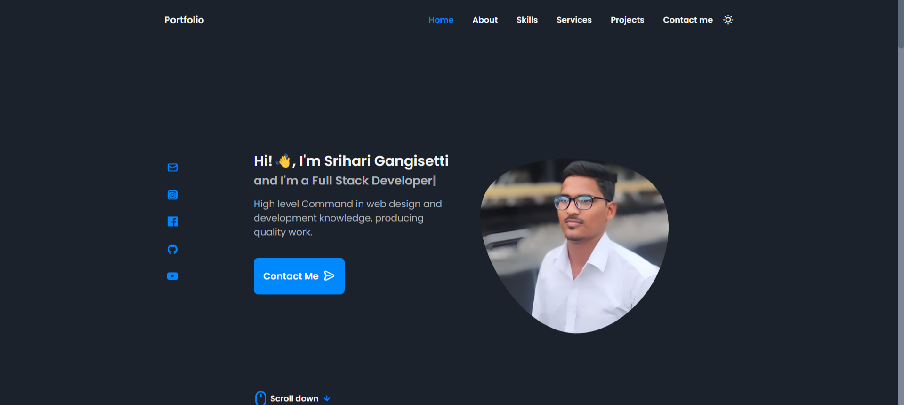

> ## Responsive Portfolio Website Srihari Gangisetti

Welcome to my portfolio!
This front page showcases a clean and modern design that reflects my skills and projects. Built using HTML, CSS, and JavaScript, it features a responsive layout that adapts seamlessly to various devices. Explore my work, skills, and achievements to get a glimpse of what I can bring to your team!

- Responsive Personal Portfolio Website Using HTML CSS & JavaScript
- Smooth scrolling in each section.
- Includes a light and dark mode.
- Developed first with the Mobile First methodology, then for desktop.
- Compatible with all mobile devices and with a beautiful and pleasant user interface.
-  Thank You for visiting😀

